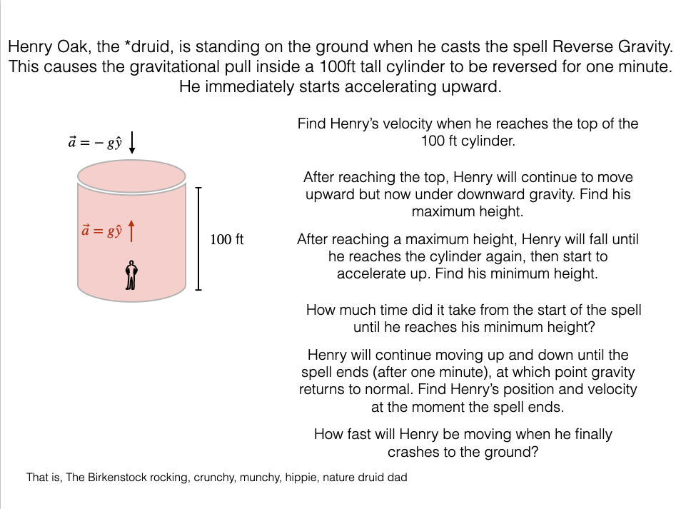
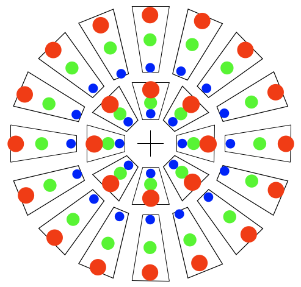

# Deleted Scenes

This page is inspired by an early episode of the podcast [Writing Excuses](https://writingexcuses.com/) when the hosts were discussing the idea of "killing your darlings" (episode 3).
One of the hosts mentioned that they keep a "deleted scenes" page for characters or scenes that don't make the final draft.

I liked that idea and thought it would be fun to keep track of my half-baked ideas that don't make it.
This will be a collection of all kinds of things – research ideas, teaching methods, example problems, etc – that I didn't quite fully develop. Maybe I'll come back to them some day.

## Quantum RPG
This idea is really trying to bring together two ideas.
1. At an [AAPT New Faculty Workshop](https://www.aapt.org/conferences/newfaculty/nfw.cfm) I saw a talk where a professor gamified electromagnetism lessons/examples by having the students role play Star Trek scenes. They would go on "away missions" that somehow involved solving EM problems, and each student had to contribute something to the solution or become a Red Shirt.
2. The first couple chapters of Griffiths Quantum Mechanics goes through solving Schrödinger's equation for various pedagogical potentials.
The sequence of potentials is cleverly chosen to build up concepts that are used for the subsequent examples.

My half-baked idea would be to synthesize the scaffolded examples and concepts from Griffiths into "skills" that players acquire in a little story-based game. For example, once the players know how to normalize a wavefunction, that becomes a skill or tool at their disposal, and it will be needed to solve future problems.

I still think there's something here, but I think there are two things I need to figure out: a mechanic for actually "using" the skills they learned, and coming up with some kind of story to drive the whole thing.

## Dungeons and Daddies problem
[Dungeons and Daddies, s2e49](https://www.dungeonsanddaddies.com/episodes/s2e49) had a character cast a spell that would reverse gravity for a region of space.
Another player pointed out the situation might lead to an interesting physics problem.
Well, here it is. I don't think I'll actually use it on a Phys 221 exam, unless I really want my students to hate me. Maybe it will be an example problem at some point.

## Achromatic Radio Interferometer
A major challenge of precision low-frequency radio cosmology experiments is the natural chromatic nature of interferometers.
The physics student will be familiar with Young's double slit experiment where light passes through two small slits, and interferes to create a fringe pattern on a screen.
The spacing of the fringes is related to wavelength or color of the light – shorter wavelengths (blue) create smaller fringe spacing compared to longer wavelengths (red).
The spacing of the two slits also affects the fringes – closer slits create larger fringe spacing.

This comes into radio interferometry when we try to use two antennas as sort of "reverse slits," measuring the light coming in from the sky at many frequencies at once.
A given pair of antennas look more spaced out for shorter wavelength light.
Think about measuring the spacing between the antennas in terms of how many wavelengths fit between them.

My proposed crazy idea to solve this is to create antennas that have a chromatic response that exactly counters the natural chromaticity of the interferometer.
If we can somehow make antennas with an electromagnetic "center" that varies with wavelength, we can arrange them so that any pair always has the same number of wavelengths between them.

In the image above, each trapezoid represents an antenna, and the colored dots represent a hypothetical electromagnetic response at different wavelengths.
If you pick any two antennas, and imagine sending the monochromatic light through "holes" of the corresponding color, you will always get the same fringe pattern. Red, green, and blue will give you the same fringes for a given pair of antennas.

So all we need is a way to construct these very weird antennas.
