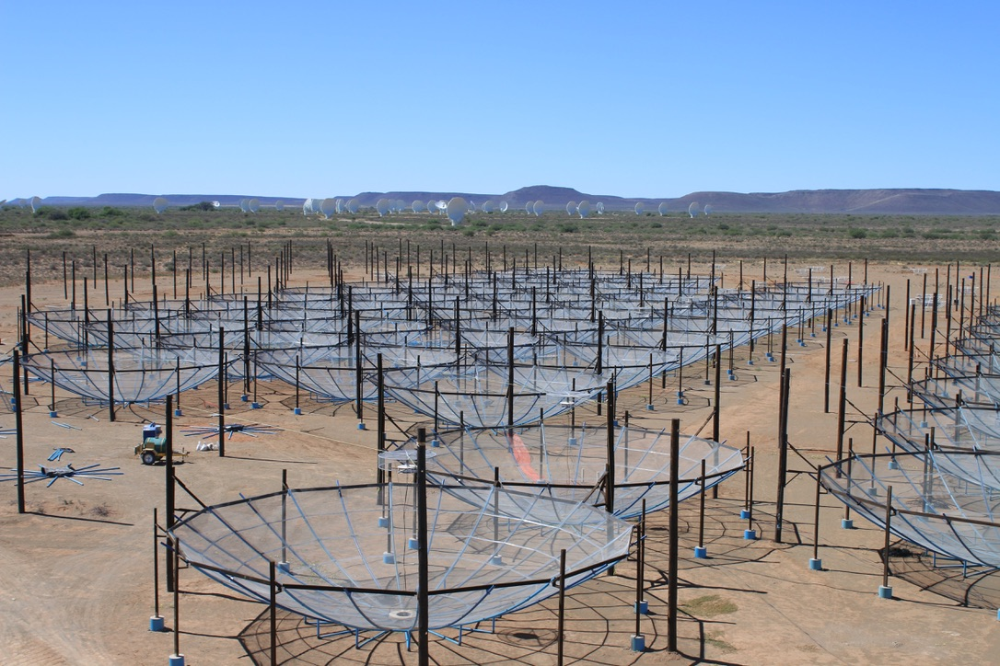
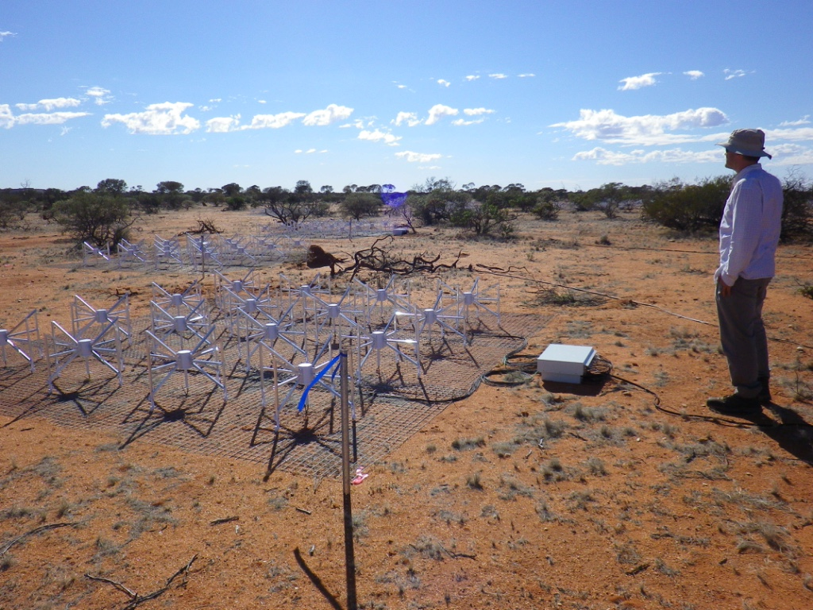
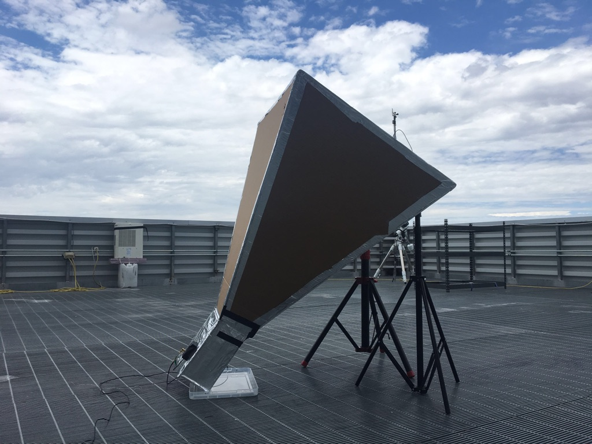

# Research

Here is an ever-changing summary of my research interests.
I've organized this page by different radio telescopes I work with.
Be sure to click the "Learn more" tabs to expand more explanation.

If you're a student looking to get involved with research, let me know what interests you!

## Hydrogen Epoch of Reionization Array

HERA is an experiment in South Africa to observe the Epoch of Reionization -- the period in the history of the Universe when stars and galaxies ionized the gas between them.

Learn more

## Murchison Widefield Array

The MWA is a general-purpose radio observatory in the western Australian outback.
With the Epoch of Reionization is a major science driver for the MWA, scientists have been using it to make huge strides in pulsar science, solar observations, galactic and extragalactic surveys, and searches for radio transient events.
I've been involved in the project since its early stages.
You can see me above checking out some antennas during a commissioning trip during my graduate studies.

Learn more

## EPIC

Learn more

## CHART

Learn more

## LWA-Swarm

Learn more

