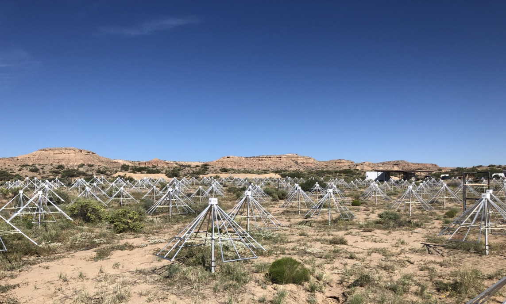

# Research

Here is an ever-changing summary of my research interests.
I've organized this page by different radio telescopes I work with.
Be sure to click the "Learn more" tabs to expand more explanation.

If you're a student looking to get involved with research, let me know what interests you!

## Hydrogen Epoch of Reionization Array

[HERA](http://www.reionization.org) is an experiment in South Africa to observe the Epoch of Reionization -- the period in the history of the Universe when stars and galaxies ionized the gas between them.  

Learn more

HERA is a purpose-driven experiment -- it is built specifically to detect radio emissions from neutral hydrogen during the Epoch of Reionization, and its design reflects the narrow mission.
It will comprise 350 dishes, mostly packed as tightly as possible to achieve high sensitivity and detect a very faint signal.
These dishes are also made on a budget, and the parts may look familiar.
In the 360 degree image below you can see PVC piping, two-by-fours, and the dish surface itself is basically chicken wire.
Telephone poles support the sensors that are suspended above the dishes to collect the radiation.

<blockquote data-width="500" data-height="375" class="ricoh-theta-spherical-image" >Dish building - <a href="https://theta360.com/s/rKdliQGeN0VWWjbhGDvS9fOrI" target="_blank">Spherical Image - RICOH THETA</a></blockquote>

I am a part of the analysis team, specifically leading the effort to ensure the data are high quality and free of contaminants that could spoil the measurement.
It turns out humans like to communicate using the same type of radio waves as HERA is trying to detect, so it's essential that we remove any of those signals that find their way into our data.

 

## Murchison Widefield Array

The [MWA](https://www.mwatelescope.org/) is a general-purpose radio observatory in the western Australian outback.
While the Epoch of Reionization is a major science driver for the MWA, scientists have been using it to make huge strides in pulsar science, solar observations, galactic and extragalactic surveys, and searches for radio transient events.
I've been involved in the project since its early stages.
You can see me above checking out some antennas during a commissioning trip during my graduate studies.

Learn more

Similar to my role in HERA, I'm a part of the MWA's Epoch of Reionization team.
My PhD thesis was based on the first major effort to reduce a full season's worth of data and place upper limits on the cosmic signal.
I also helped design the telescope by optimizing the placement of the antennas to yield high sensitivity and maintain robust imaging capability.
You can see what the radio sky looks like to the MWA in the image below, from the GLEAM team.
In the image you can see the prominent galactic plane, many super nova remnants, and all the little dots are other galaxies!

<!--  -->

<em> Image credit: Natasha Hurley-Walker/ICRAR/Curtin/GLEAM Team</em> 

In 2016 the MWA got an upgrade to "Phase II."
We added more antennas, this time tightly packed in the core to mimic the layout of HERA, which will allow interesting comparisons.

I served as the Project Scientist for the MWA from 2018 to 2020.
This was an exciting experience as I worked with all the science groups -- not just the Epoch of Reionization team.

 

## EPIC

Ok, EPIC isn't exactly a telescope.
Rather, EPIC is a project to develop technologies that will make radio telescopes of the future possible.
Today radio arrays consist of hundreds of antennas, but in a decade or two, they will have tens of thousands of antennas.
These instruments rely on powerful, usually custom built, computers to process the data from the antennas.
As the number of antennas grows, the computers need to keep pace, and that's where EPIC comes in.

<blockquote data-width="500" data-height="375" class="imgur-embed-pub" lang="en" data-id="a/umewybd"></blockquote>

Learn more

In order to make images of the sky, radio telescopes (specifically interferometers), need to cross-correlate the signals from all <em>pairs</em> of antennas.
So if we need ten times as many antennas, that means we need to make 100 times as many cross correlations!
It will be very challenging for computers to keep up.

EPIC takes a different approach.
We can use a simple math trick to create images of the raw data prior to cross-correlation.
Under certain circumstances, this can drastically save on computational requirements.
It also has the bonus of forming images at really high time resolution.
The animation above was captured using the Long Wavelenght Array in New Mexico.
It shows a TV signal being reflected off the trail of a meteor entering the atmosphere.
Each frame in the movie is 1/20th of a second.

This technology will not only allow for bigger and better telescopes, but it may also open the door for fast radio transient studies.

 

## CHART

Learn more

 

## LWA-Swarm

Learn more

