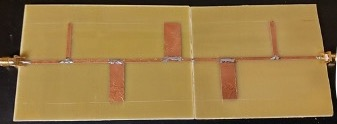
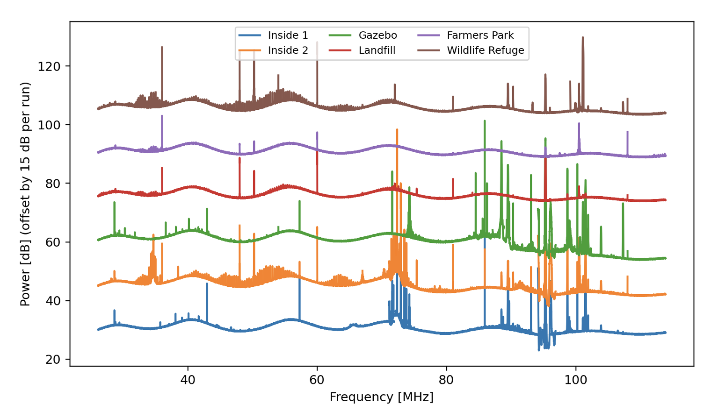
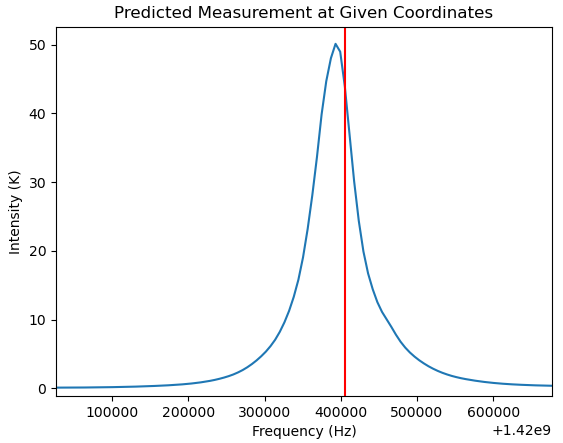

# Student Projects
Here's a running list of student research and design projects I've mentored. If you're a student looking to get involved, this is a good place to see what others have been up to lately.

## CHART Data Analysis
*Emma Dachel, 2022*

Emma participated in WSU's Early Year Research & Creative Mentoring ([EYRCM](https://www.winona.edu/grants/early-year.asp)) pilot program. The program matches students early in their collegiate career with research mentors. Emma's project was to dive into some CHART data collected at ASU and look for any issues that need to be investigated. She found and cataloged several anomolies, uncovering bugs in our data collection system. She went on to study one of the issues, and found that our SDR is using an automatic gain control (AGC), which is typically not desirable for astronomy applications.

## CHART Filter
*Nahom Nemera, 2021-2022*

For his engineering design project, Nahom looked to replace the very expensive bandpass filter CHART has been using so far. His goal was to find a more affordable option that performs well enough to detect the 21cm hydrogen line. He explored cheaper off-the-shelf options, home made microstrip filters, and his own printed circuit board versions. While simulations of his latest PCB design showed the best performance, we are still experiencing issues with the implemented filter. Until those issues are worked out, the current best option is a [Nooelec SAWbird filter](https://www.nooelec.com/store/sawbird-h1-barebones.html_).

## Solar Radio Bursts with EPIC
*Isaac Conrad, 2021-2022*

## Machine Learning to Identify RFI
*Sheikh Fahad, 2021*

## Radio Observatory Scouting
*Serdar Chifji, 2021*

## Simulating CHART Data
*Dylan Gappa, 2020-2021*

## Cosmology Parameter Searches with 21cmFAST
*Megh Khanal, 2020-2021*
