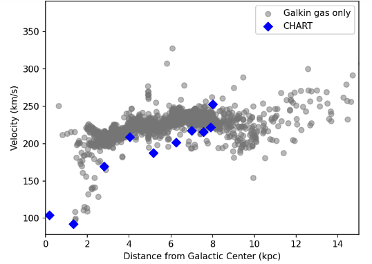
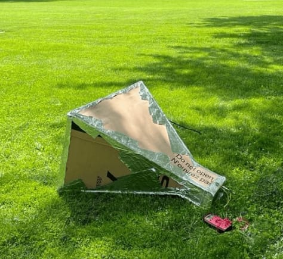
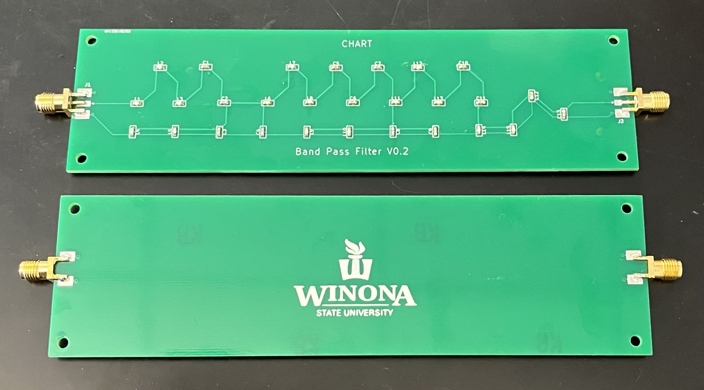

# Student Projects
Here's a running list of student research and design projects I've mentored. If you're a student looking to get involved, this is a good place to see what others have been up to lately.

## Galaxy Rotation Curve with CHART
*Carly Fitzgerald, 2024*
Carly has been working on using CHART to observe hydrogen gas in the Milky Way galaxy and map out how fast the gas is going depending on how far it is from the galactic center. She is using the "tangent point method" for the inner galaxy, and exploring ways to extend to the outer galaxy, which gets a little more complicated. Along the way she has also been exploring ways to improve the calibration of the CHART data.

## Transient Searches with EPIC
*Michaud, 2024*
Sam looked at Fast Radio Burst (FRB) detections from the CHIME telescope and looked into the best ways for EPIC (which is deployed on the LWA in New Mexico) to follow up or simultaneously observe FRBs. He also did data validation work as the system was being upgraded and did early looks at automatic follow-ups that were triggered from CHIME detections.

## Versatile Multi-Sport Scoreboard
*Jake Van Hulzen, 2023-2024*

For Jake's senior design project, he set out to create a scoreboard that could
accommodate a variety of different sports in different settings, all while
keeping the costs low with public/community recreation programs in mind.
He pulled together programmable LEDs, multiple microcontrollers, button pads,
and radio communication to make the whole design work.

## Early-Year CHART Students
*Landyn Schroeder, Sammy Schneider, Carly Fitzgerald, 2024*

These three students participated in WSU's [Early Year Research and Creative
Mentoring](https://www.winona.edu/academics/research/funding-for-research/) program.
They worked together but each took on their own aspect of the project.
Sammy focused on developing and publishing an observing protocol to ensure
consistent and quality data.
Landyn hunted some anomolous radio interference we observed in the protected 21cm
radio astronomy band.
Carly used CHART data to measure the speed that gas in the Milky Way galaxy rotates.
Once developed further, this work can be used to show evidence for dark matter.

## Driver Alert Mechanism
*Jude Riley, 2022-2023*

For Jude's senior design project, he is creating a device to more actively
alert drivers when a car brakes quickly. He hopes to make the brake light
more effective by displaying differently when there is a hard brake vs a light
brake. The challenge is doing this in an affordable way that can be installed
after market without comprimising the existing safety of the car, and of course
making sure all alterations are legal for vehicles on the road.

## Design and Performance of CHART
*Ahlea Wright, 2022*

Ahlea took on all things CHART hardware over the summer.
She characterized our filter and amplifier options, built a few horns to test
their performance and refine the building strategy, and she collected some of the
best data CHART has seen so far.
Ahlea guided several high school teachers in building their own CHART horns,
and she presented her work at the [2023 AAS meeting in Seattle](https://ui.adsabs.harvard.edu/abs/2023AAS...24117003A/abstract).

## CHART GUI and Community Server
*Lindsey Arndt, 2022*

Lindsey is interested in human-computer interaction and she spearheaded the creation of
a graphical user interface (GUI) to streamline CHART data collection.
The project came about because Lindsey recognized that interfacing with the Linux command
line would be a prohibitive step for teachers and students just starting out.
So she created the interface shown above which collects relevant metadata and takes
various observing parameters as inputs, then launches the CHART data collection script.
Lindsey took it even further by setting up a community server where participants
can upload their data and analyze it on a shared cloud computer.
All these awesome tools were tested during a summer workshop where we invited
high school teachers to come to WSU and build their own CHART.
Lindsey presented her work at the [2023 AAS meeting in Seattle](https://ui.adsabs.harvard.edu/abs/2023AAS...24117003A/abstract).

## CHART Data Analysis
*Emma Dachel, 2022*

Emma participated in WSU's Early Year Research & Creative Mentoring ([EYRCM](https://www.winona.edu/grants/early-year.asp)) pilot program. The program matches students early in their collegiate career with research mentors. Emma's project was to dive into some CHART data collected at ASU and look for any issues that need to be investigated. She found and cataloged several anomolies, uncovering bugs in our data collection system. She went on to study one of the issues, and found that our SDR is using an automatic gain control (AGC), which is typically not desirable for astronomy applications.

## CHART Filter
*Nahom Nemera, 2021-2022*

For his engineering design project, Nahom looked to replace the very expensive bandpass filter CHART has been using so far. His goal was to find a more affordable option that performs well enough to detect the 21cm hydrogen line. He explored cheaper off-the-shelf options, home made microstrip filters, and his own printed circuit board versions. While simulations of his latest PCB design showed the best performance, we are still experiencing issues with the implemented filter. Until those issues are worked out, the current best option is a [Nooelec SAWbird filter](https://www.nooelec.com/store/sawbird-h1-barebones.html_).

## Solar Radio Bursts with EPIC
*Isaac Conrad, 2021-2022*

Isaac recently finished his senior research project, which was to demonstrate [EPIC](research#epic)'s ability to observe solar radio bursts. EPIC is a brand new system, and Isaac's work has helped to uncover some bugs in the data collection. He ended up studying one solar burst, which he was able to classify as Type III and measure its drift rate. We hope this analysis will lead to studying many more bursts in the future.

## Machine Learning to Identify RFI
*Sheikh Fahad, 2021*

Fahad is a Computer Science major with an interest in artificial intelligence. He wanted to incorporate that interest into a radio astronomy project by exploring machine learning to identify radio frequency interference (RFI). This has been attempted with other telescopes in the past, but [EPIC](research#epic) has its own challenges because its data product is unlike other radio telescopes. Fahad studied different image classification learning algorithms, and built a training set with existing EPIC data. Along the way, he also implemented continuous integration for the project so we can develop unit tests to ensure project stability.

## Radio Observatory Scouting
*Serdar Chifji, 2021*

Serdar spent the summer working with different radio telescopes, with the goal to study the radio frequency environment around Winona. He assembled and tested an LWA antenna, and designed a portable system to drive around and record RF spectra. Above you can see low-frequency spectra from several locations around town. The Farmer's Community Park shows very little interference, demonstrating that the bluffs in the area can effectively shade us from radio towers. We hope that future expeditions will help us find the perfect location for a Winona Radio Observatory.

## Simulating CHART Data
*Dylan Gappa, 2020-2021*

CHART has been able to collect data that looks like the 21cm hydrogen line, but an open question is how we know that the little bump we see is really the galaxy. One piece of evidence is to compare our data with professional surveys. Dylan set out to do this using the [HI4PI Survey](https://ui.adsabs.harvard.edu/abs/2016A%26A...594A.116H/abstract). He used this data and wrote a program to simulate CHART's response (a very large field of view) for any location, time, and pointing direction. We hope to use simulated data like you see above to compare with CHART observations.

## Cosmology Parameter Searches with 21cmFAST
*Megh Khanal, 2020-2021*

Megh was interested in a theoretical cosmology project. So he learned to use the 21cmFAST semi-numerical software to simulate the Epoch of Reionization for a given set of cosmological and astrophysical parameters. We then undertook a "parameter search" exercise where I created a "true" universe, and Megh created a suite of simulations, varying parameters, until he found a set of parameters that statistically matched the universe I created for him. This is the type of strategy cosmologists use to match data to numerical models and constrain our understanding of how the universe evolved.
